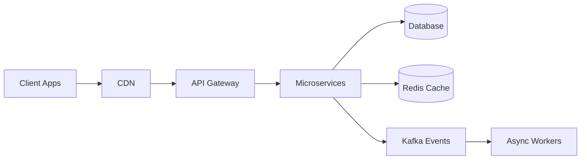

# ⚙️ Shubham Vijay Vargiy — Code Architect

### *Founding Engineer · Staff Full-Stack Engineer · Distributed Systems Architect*

🌐 **Portfolio:** https://www.shubhamvijay.dev

<p align="center">
  
</p>

<p align="center">
  
  
  
</p>

---

## 🚀 About Me

I’m a **Founding Engineer–minded Staff Full Stack Engineer with 10+ years of experience** building **scalable, high-impact systems from scratch**.

👉 I specialize in **Node.js, React, and distributed systems**, but my real strength is:

```txt
Idea → Architecture → Scale → Business Impact
```

* 🚀 Built platforms handling **1M+ SKUs & high traffic systems**
* 🧠 Designed **event-driven & distributed systems (Kafka, Redis)**
* ⚡ Delivered **bi-weekly releases with 99.9% uptime**
* 👨‍💻 Led teams & drove architecture decisions

📍 India | 🌍 Open to global opportunities

---

## 🧠 Core Expertise

```txt
⚙️ Backend        → Node.js, NestJS, Express, GraphQL, Microservices
🎯 Frontend       → React, Next.js, Angular, TypeScript
📱 Mobile         → React Native, PWA, Ionic
☁️ Cloud          → AWS, GCP, Azure, Docker, CI/CD
🧩 Databases      → PostgreSQL, MongoDB, MySQL, Redis
🔗 Systems        → Kafka, Event-driven architecture, Distributed systems
🤖 AI Systems     → OpenAI, Gemini, OCR, Voice AI, RAG
📊 Observability  → ELK, Prometheus, Grafana, OpenTelemetry
```

---

## 🏗️ Architecture Mindset



👉 I design systems for **scale, fault tolerance, and real-world production reliability**

---

## 🔥 Impact Highlights

### 🚀 Scalable Commerce Platform

* Handled **1M+ SKUs & high traffic users**
* Built **dynamic CMS layout engine (Strapi)**
* Achieved **99.9% uptime with continuous releases**

---

### ⚡ Distributed Systems

* Kafka-based **event-driven architecture**
* Redis **distributed caching**
* GraphQL **API gateway design**

---

### 🤖 AI + Automation

* Built **LLM-powered voice assistants**
* Automated real-world workflows (guest systems, booking)

---

### 📱 Mobile Platforms

* Built scalable apps using **React Native**
* Delivered real-time transactional systems

---

## 🧬 Featured Projects

* 🧭 AI Travel Platform → *(Add your demo link)*
* 🛒 Marketplace System → *(Add your demo link)*
* 🎰 Lottery Platform → *(Add your demo link)*
* 🏨 Guest Experience Platform → *(Add your demo link)*
* 📊 Analytics Platform → *(Add your demo link)*

---

## 🧩 Case Study: Scalable Commerce Platform

**Problem**
Handling large-scale catalog (**1M+ SKUs**) with need for dynamic UI updates

**Solution**

* Built **Strapi CMS layout engine**
* Designed **microservices architecture**
* Implemented **Redis caching + API optimization**

**Architecture**

```txt
Client → CDN → API Gateway → Services → DB + Cache + Kafka
```

**Impact**

* ⚡ Improved performance & scalability
* 🚀 Enabled non-tech teams to manage UI
* 📈 Maintained **99.9% uptime**

---

## 🤖 Case Study: AI Voice Platform

**Problem**
Manual workflows causing inefficiency in operations

**Solution**

* Built **LLM-powered voice assistant**
* Integrated with APIs for automation
* Enabled real-time voice interactions

**Impact**

* 🤖 Reduced manual effort
* ⚡ Improved response time
* 💡 Enabled AI-driven workflows

---

## 📊 GitHub Analytics

<p align="center">
  
</p>

---

## 🧑‍💻 Engineering Philosophy

> “I don’t just build features — I design systems that scale, perform, and last.”

---

## 🏷️ Recruiter Keywords

`#StaffEngineer` `#FoundingEngineer` `#SystemDesign`
`#DistributedSystems` `#NodeJS` `#ReactJS`
`#NextJS` `#Kafka` `#Microservices`
`#CloudNative` `#AIEngineer` `#ScalableSystems`

---

## 📬 Let’s Connect

* 📧 Email: [svijay1692@gmail.com](mailto:svijay1692@gmail.com)
* 🔗 LinkedIn: https://linkedin.com/in/svijay1692
* 💻 GitHub: https://github.com/Shubh1692

---

## ⚡ Code Architect Mode

```js
while (true) {
  architect("scalable systems");
  optimize("performance");
  deliver("impact 🚀");
}
```
